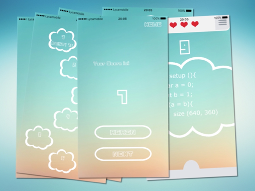

# TrackBug iOS App

An iOS application where people have to kill the bug for the programming beginner. A code snippet that throws a certain error. The users have to track the bug to continue to the next level.

This project is worked on by Wenbo Liu. Concept based on Fabian Westhoff

I've also made a demo video to explain in an overview what the application is about.

## Version:

- Xcode 7
- iPhone 6s
- iOS 9

## To do:

- Database
- More levels
- Support more languages
